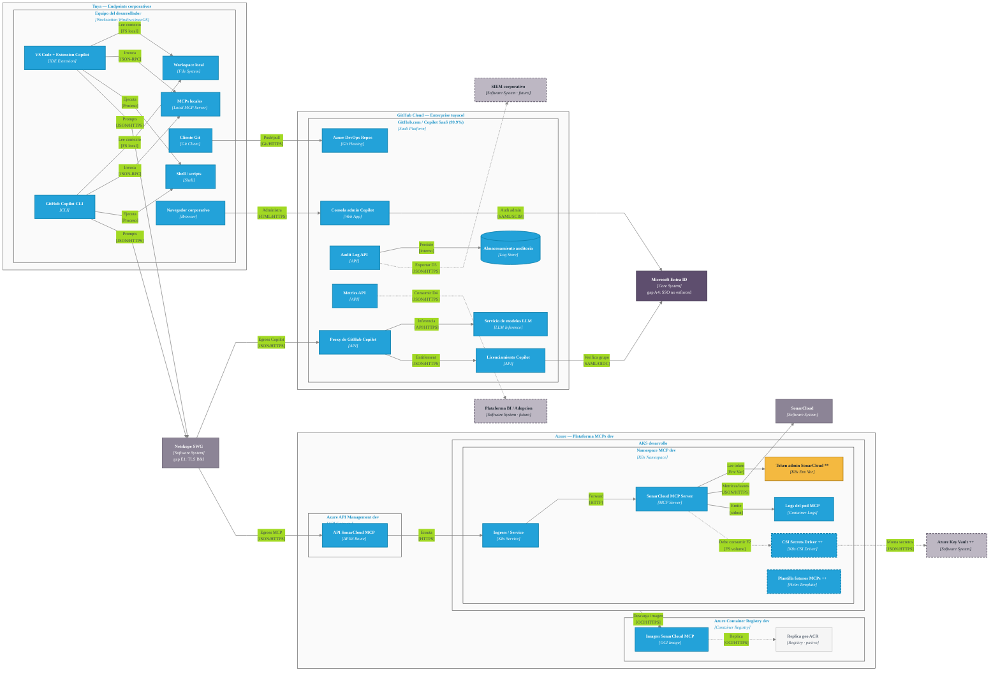

# Diagrama de despliegue de GitHub Copilot (v2) — Explicacion

> Archivo fuente: [`diagrams/02-deployment-copilot-v2.drawio`](../diagrams/02-deployment-copilot-v2.drawio)
> Nivel C4: **C2 — Despliegue**
> Estandar aplicado: [`.github/skills/drawio-deployment/SKILL.md`](../.github/skills/drawio-deployment/SKILL.md)
> Contexto base: `docs/Arquitectura-de-Solucion-GitHub-Copilot.md`, `docs/architecture-gaps.md`, `docs/session-context.md`.

Este diagrama es una **vista alternativa y refinada** del actual `02-deployment-copilot.drawio`. No reemplaza al original: agrega elementos que faltaban (workspace local, navegador, almacenamiento de auditoria, CSI Secrets, BI/SIEM destino, replica ACR) y reorganiza el layout en tres entornos claros.

---

## Vista embebida (Mermaid)

> Renderizable directamente en GitHub, VS Code y la mayoria de visores de Markdown. Para la version interactiva con routing ortogonal ELK, abrir `presentation/02-deployment-copilot.html`.



**Convenciones Mermaid (mismo significado que la version draw.io):**

- Azul solido `#23A2D9` = unidad de despliegue.
- Azul con borde **discontinuo** = unidad nueva `++`.
- Amarillo `#F4B940` = unidad modificada `**` (deuda actual).
- Gris solido `#8C8496` = sistema externo.
- Morado `#5E4E6E` = Core System (Entra ID).
- Gris claro con borde discontinuo = sistema futuro / recomendado.
- Linea solida = relacion runtime actual.
- Linea **discontinua** (`-.->`) = relacion recomendada / futura (gap).

---

## 1. Alcance y proposito

Muestra como las unidades de despliegue de GitHub Copilot dentro de Tuya se ejecutan, donde corren y que dependencias runtime consumen. El alcance cubre:

1. **Endpoints corporativos Tuya** (on premise) — el dev y sus herramientas locales.
2. **GitHub Cloud Enterprise tuyacol** — Copilot SaaS, modelos LLM, consola admin, audit/metrics, Azure DevOps Repos.
3. **Azure dev** — plataforma corporativa de MCPs (APIM + ACR + AKS) con el SonarCloud MCP.

Y los sistemas externos/core que aparecen como dependencias runtime: **Microsoft Entra ID**, **Netskope SWG**, **SonarCloud**, **Azure Key Vault++**, **SIEM corporativo**, **Plataforma de BI/Adopcion**.

---

## 2. Convenciones visuales

| Color | Significado |
|---|---|
| `#23A2D9` (azul) | Unidad de despliegue (software empaquetado y ejecutado) |
| `#8C8496` (gris) | Sistema externo o Core System |
| Borde discontinuo `#444444` | Boundary de **entorno** (cloud / on premise) |
| Borde solido `#6B6B6B` transparente | **Nodo de despliegue** activo (cluster, namespace, workstation, registry) |
| `#F5F5F5` con borde claro | Nodo o sistema **pasivo / failover** |
| Borde o linea **punteada** en azul | Unidad **nueva (++)** o recomendada / futura |
| Borde **punteado** en gris | Sistema externo **recomendado / futuro** |
| Sufijo `++` | Elemento **nuevo** a crear |
| Sufijo `**` | Elemento **modificado** (estado actual con deuda) |
| Flecha gris `#828282` | Relacion runtime; siempre apunta al destino de la dependencia |
| Linea de relacion punteada | Relacion **recomendada / futura** (gap) |

---

## 3. Entornos (boundaries de mas alto nivel)

### 3.1 Tuya — Endpoints corporativos `[Environment: on premise]`

Representa las estaciones de los desarrolladores. Es el unico entorno on-premise del diagrama. Todo lo que sale de aqui pasa **obligatoriamente** por Netskope.

### 3.2 GitHub Cloud — Enterprise tuyacol `[Environment: cloud]`

SaaS de GitHub donde vive el Enterprise corporativo. Sin acceso a la infraestructura subyacente — modelado como deployment node opaco `GitHub.com / Copilot SaaS`. Disponibilidad publicada del servicio: 99.9%.

### 3.3 Azure — Plataforma corporativa de MCPs dev `[Environment: cloud]`

Suscripcion de desarrollo de Tuya donde corre la plataforma de **MCPs corporativos**. Hoy solo expone el `SonarCloud MCP` (gap F3: solo existe en dev).

---

## 4. Nodos de despliegue (infraestructura)

| Nodo | Tipo | Donde vive | Notas |
|---|---|---|---|
| **Equipo del desarrollador (N/A)** | Workstation Windows/macOS | Tuya on premise | Aloja IDE, CLI, MCPs locales, shell, Git, workspace y navegador |
| **GitHub.com / Copilot SaaS (99.9%)** | SaaS Platform | GitHub Cloud | Opaco: aloja proxy, modelos, consola admin, audit/metrics, repos, licenciamiento |
| **Azure API Management dev (N/A)** | API Gateway | Azure | Solo enruta hacia el MCP; sin auth/politicas propias |
| **Azure Container Registry dev (N/A)** | Container Registry | Azure | Mirror de imagenes de MCPs |
| **AKS desarrollo (N/A)** | Kubernetes Cluster | Azure | Aloja el namespace de MCPs |
| **Namespace MCP dev** | Kubernetes Namespace | AKS | Aisla los workloads de MCPs corporativos |

> `(N/A)` significa que la disponibilidad/SLA no esta publicada para el entorno dev. Para una vista de produccion deberia poblarse este dato.

---

## 5. Unidades de despliegue

### 5.1 En la estacion del desarrollador

| Unidad | Tipo | Responsabilidad |
|---|---|---|
| **VS Code + Extension Copilot** | IDE Extension | Chat, autocompletado, modo agente y modo plan. Envia prompts al proxy y orquesta MCPs locales |
| **GitHub Copilot CLI** | CLI | Cliente Copilot en terminal con modo agente. Mismo backend que la extension |
| **MCPs locales** | Local MCP Server | Procesos hijos (stdio/JSON-RPC) configurados por el dev — file system, busqueda, contexto, etc. |
| **Shell / scripts** | Shell | Ejecuta comandos que el modo agente decide invocar |
| **Cliente Git** | Git Client | Opera contra Azure DevOps Repos |
| **Workspace local** | File System | Codigo abierto; fuente de contexto enviado a Copilot. Critico para evaluar exposicion de codigo sensible (gap D1) |
| **Navegador corporativo** | Browser | Acceso a la consola administracion Copilot |

### 5.2 En GitHub Cloud / Copilot SaaS

| Unidad | Tipo | Responsabilidad |
|---|---|---|
| **Proxy de GitHub Copilot** | API | Recibe prompts, aplica controles (Content Exclusions, telemetry, filtros) y enruta a modelos |
| **Servicio de modelos LLM** | LLM Inference Service | Backend opaco que ejecuta la inferencia |
| **Consola administracion Copilot** | Web App | Licencias, politicas, **Content Exclusions** (gap D1: no configuradas) |
| **Audit Log API** | API | Eventos de uso, admin y politicas (gap D3: no exportada a SIEM) |
| **Metrics API** | API | Aceptacion, sugerencias, usuarios activos (gap D4: no consumida) |
| **Servicio de licenciamiento Copilot** | API | Valida sesion y entitlement contra el grupo en Entra ID |
| **Azure DevOps Repos** | Git Hosting | Modelado como deployment unit dentro del Enterprise para mostrar dependencia del cliente Git |
| **Almacenamiento de auditoria** | Log Store (cilindro) | Retencion de eventos del Audit Log |

### 5.3 En Azure dev (plataforma de MCPs)

| Unidad | Tipo | Responsabilidad |
|---|---|---|
| **API SonarCloud MCP** | API Gateway Route | Endpoint en APIM que enruta hacia el cluster. Sin auth/politicas propias hoy |
| **Imagen SonarCloud MCP** | OCI Image | Mirror corporativo en ACR de la imagen oficial del MCP |
| **Ingress / Service** | Kubernetes Service | Publica el pod del MCP dentro del cluster |
| **SonarCloud MCP Server** | MCP Server | Pod que atiende JSON-RPC y consulta SonarCloud |
| **Token admin SonarCloud `**`** | Kubernetes Env Var | Secreto **actual** en env var del deployment (gap F2 a migrar) |
| **CSI Secrets Driver `++`** | K8s CSI Driver | **Recomendado** para montar secretos desde Azure Key Vault — reemplaza el env var |
| **Logs del pod MCP** | Container Logs | stdout/stderr; insumo para integrar con SIEM |
| **Plantilla futuros MCPs `++`** | Helm Template | Base reutilizable para nuevos MCPs corporativos (resuelve F3) |

---

## 6. Sistemas externos y Core Systems

| Sistema | Tipo | Rol |
|---|---|---|
| **Netskope SWG** | Software System | Gateway corporativo de salida. Allowlist de URLs Copilot/MCP. TLS break-and-inspect por validar (gap E1) |
| **Microsoft Entra ID** | **Core System** | IdP corporativo. SAML SSO + grupo de licenciamiento. Configurado pero **no enforced** (gap A4) |
| **SonarCloud** | Software System | SaaS de calidad consultado por el MCP corporativo |
| **Azure Key Vault `++`** | Software System | Boveda **recomendada** para los secretos runtime del MCP (resuelve F2) |
| **SIEM corporativo** | Software System (futuro) | Destino recomendado para exportar el Audit Log (resuelve D3) |
| **Plataforma de BI / Adopcion** | Software System (futuro) | Consumidor recomendado de Metrics API (resuelve D4) |
| **Replica geo ACR (recomendada)** | Software System (pasivo) | Failover de imagenes — fill `#F5F5F5` por ser pasivo |

---

## 7. Relaciones principales

Las relaciones siempre apuntan **al destino de la dependencia**. Cada flecha trae **verbo + `[contenido/protocolo]`**.

### 7.1 Endpoint -> Copilot

| Origen | Destino | Verbo | Protocolo |
|---|---|---|---|
| VS Code + Extension | Workspace local | Lee contexto de codigo | FS local |
| CLI | Workspace local | Lee contexto de codigo | FS local |
| VS Code / CLI | MCPs locales | Invoca herramientas | JSON-RPC/stdio |
| VS Code / CLI | Shell / scripts | Ejecuta comandos | Proceso local |
| Cliente Git | Azure DevOps Repos | Push/pull codigo | Git/HTTPS |
| VS Code / CLI | Netskope SWG | Envia prompts/chat | JSON/HTTPS |
| Navegador | Consola admin Copilot | Administra Enterprise | HTML/HTTPS |

### 7.2 Borde corporativo y backend Copilot

| Origen | Destino | Verbo | Protocolo |
|---|---|---|---|
| Netskope SWG | Proxy de GitHub Copilot | Permite egress Copilot | JSON/HTTPS |
| Proxy de GitHub Copilot | Servicio de modelos LLM | Solicita inferencia | API interna/HTTPS |
| Proxy de GitHub Copilot | Servicio de licenciamiento | Valida entitlement | JSON/HTTPS |
| Servicio de licenciamiento | Microsoft Entra ID | Verifica grupo y SSO | SAML/OIDC |
| Consola admin Copilot | Microsoft Entra ID | Autentica admin | SAML/SCIM |
| Audit Log API | Almacenamiento de auditoria | Persiste eventos | interno |
| Audit Log API | **SIEM corporativo** (futuro) | Debe exportar | JSON/HTTPS (punteada) |
| Metrics API | **Plataforma BI** (futuro) | Debe consumir | JSON/HTTPS (punteada) |

### 7.3 MCP corporativo

| Origen | Destino | Verbo | Protocolo |
|---|---|---|---|
| Netskope SWG | API SonarCloud MCP (APIM) | Permite egress MCP | JSON/HTTPS + token usuario |
| APIM | Ingress/Service | Enruta solicitud | HTTPS |
| Ingress/Service | SonarCloud MCP Server | Forward request | HTTP |
| SonarCloud MCP Server | Token admin SonarCloud `**` | Lee token admin | Env Var |
| SonarCloud MCP Server | SonarCloud | Consulta metricas e issues | JSON/HTTPS + token admin |
| SonarCloud MCP Server | Logs del pod MCP | Emite logs | stdout/stderr |
| AKS desarrollo | Imagen SonarCloud MCP (ACR) | Descarga imagen | OCI/HTTPS |
| Imagen SonarCloud MCP | Replica geo ACR (pasiva) | Replica imagen | OCI/HTTPS (punteada) |
| SonarCloud MCP Server | CSI Secrets Driver `++` (futuro) | Debe consumir | FS volume (punteada) |
| CSI Secrets Driver `++` | Azure Key Vault `++` | Monta secretos | JSON/HTTPS (punteada) |

---

## 8. Gaps de arquitectura representados

Cada gap del documento `docs/architecture-gaps.md` esta visible en el diagrama:

| Gap | Donde aparece en el diagrama |
|---|---|
| **A4** SSO Entra configurado, no enforced | Anotacion en el label de Microsoft Entra ID |
| **D1** Sin Content Exclusions | Implicito en el rol de la Consola admin Copilot + nota |
| **D3** Audit logs no exportados a SIEM | Flecha **punteada** Audit Log API -> SIEM corporativo |
| **D4** Metrics API no consumida | Flecha **punteada** Metrics API -> Plataforma BI |
| **E1** TLS break-and-inspect Netskope por validar | Anotacion en label de Netskope |
| **F2** Token admin SonarCloud en env var | Unidad `Token admin SonarCloud **` + flecha **punteada** hacia `CSI Secrets Driver++` y `Azure Key Vault++` |
| **F3** MCP corporativo solo en dev | Unidad **punteada** `Plantilla futuros MCPs++` y ambiente etiquetado `MCPs dev` |

Los gaps tambien estan listados explicitamente en la nota amarilla al pie del diagrama.

---

## 9. Por que esta version (v2)

Comparado con `02-deployment-copilot.drawio`, esta version:

1. **Materializa el workspace local** como unidad — clave para discutir Content Exclusions y exposicion de codigo sensible.
2. **Separa Audit Log y Metrics API** en unidades distintas con sus consumidores futuros (SIEM y BI).
3. **Modela el servicio de licenciamiento Copilot** y su dependencia con Entra ID — explicita la cadena SSO + entitlement.
4. **Agrega CSI Secrets Driver `++`** como unidad intermedia hacia Key Vault, en vez de una flecha directa pod -> vault.
5. **Convierte Azure DevOps Repos y el Servicio de modelos LLM** en deployment units dentro de sus respectivos nodos SaaS, en vez de software systems externos sueltos.
6. **Agrega replica geo ACR pasiva** como ejemplo de uso del color `#F5F5F5` para nodos pasivos.
7. **Agrega navegador y logs del pod** como unidades, para conectar todos los actores y dejar visible la trazabilidad operativa.

El diagrama original sigue siendo valido como vista mas compacta; v2 es la vista detallada para revisiones de seguridad y plan de remediacion.

---

## 10. Como abrir / exportar

```powershell
Invoke-Item .\diagrams\02-deployment-copilot-v2.drawio

# Exportar PNG con XML embebido (editable):
& "C:\Program Files\draw.io\draw.io.exe" -x -f png -e -b 10 `
  -o diagrams\02-deployment-copilot-v2.drawio.png `
  diagrams\02-deployment-copilot-v2.drawio
```
